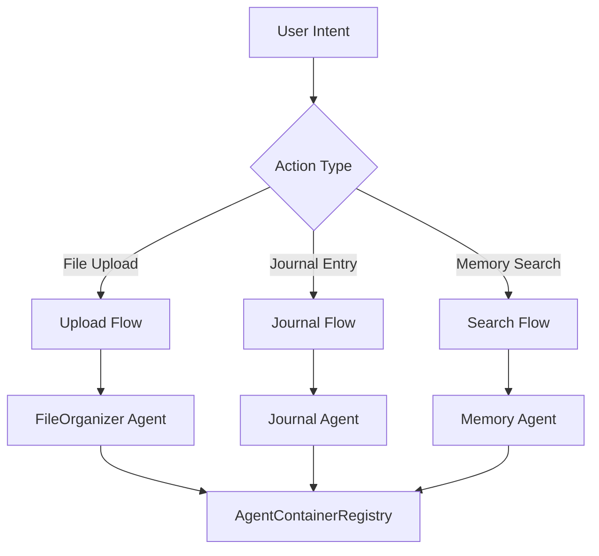

# 🏗️ FileInASnap Architecture Guide

## BMAD Methodology & Agent Container Registry

FileInASnap implements the **Build-Measure-Analyze-Deploy (BMAD)** methodology through a containerized agent architecture. Each AI agent operates independently while sharing common infrastructure and pricing logic.

## 🧠 BMAD Architecture Overview

### **B**: Behavioral Flow – User Intent Triggers
The behavioral layer captures user intent and maps it to appropriate agent workflows:



**Behavioral Triggers:**
- **File Upload Flow**: User drags/drops files → triggers FileOrganizerAgent
- **Journal Entry Flow**: User writes text/voice → triggers JournalAgent  
- **Memory Exploration**: User searches memories → triggers MemoryAgent
- **Story Creation**: User selects memories → triggers StoryAgent
- **Analytics Request**: Admin views dashboard → triggers AnalyticsAgent

### **M**: Modular Agents – Containerized AI Units

Each agent is a self-contained module with specific responsibilities:

#### 🗂️ FileOrganizer Agent Container
```typescript
interface FileOrganizerContainer {
  name: 'fileOrganizerAgent';
  version: '2.0.0';
  
  // Behavioral triggers
  triggers: ['file.uploaded', 'folder.created', 'manual.organize'];
  
  // Sub-agents based on plan tier
  subAgents: {
    'standard': ['renamer', 'tagger', 'scorer'];
    'pro': ['renamer', 'tagger', 'scorer', 'gemini-analyzer'];
    'veteran': ['renamer', 'tagger', 'scorer', 'claude-processor', 'chain-optimizer'];
    'enterprise': ['renamer', 'tagger', 'scorer', 'claude-opus', 'audit-logger'];
    'creator': ['renamer', 'tagger', 'gpt4-content', 'video-captioner'];
  };
  
  // Resource allocation by plan
  resources: {
    'standard': { cpu: '100m', memory: '256Mi', groq: true };
    'pro': { cpu: '200m', memory: '512Mi', gemini: true };
    'veteran': { cpu: '400m', memory: '1Gi', claude: true, chaining: true };
    'enterprise': { cpu: '800m', memory: '2Gi', claude: true, audit: true };
    'creator': { cpu: '300m', memory: '768Mi', video: true, audio: true };
  };
}
```

#### 📝 Journal Agent Container
```typescript
interface JournalAgentContainer {
  name: 'journalAgent';
  version: '2.0.0';
  
  triggers: ['journal.created', 'voice.recorded', 'memory.tagged'];
  
  subAgents: {
    'standard': ['readonly-viewer'];
    'pro': ['emotion-analyzer', 'memory-extractor', 'timeline-builder'];
    'veteran': ['emotion-analyzer', 'memory-extractor', 'voice-processor', 'agent-chains'];
    'enterprise': ['emotion-analyzer', 'memory-extractor', 'voice-processor', 'audit-tracker'];
    'creator': ['emotion-analyzer', 'content-optimizer', 'story-suggester'];
  };
  
  capabilities: {
    voiceProcessing: ['veteran', 'enterprise'];
    emotionAnalysis: ['pro', 'veteran', 'enterprise', 'creator'];
    memoryTimeline: ['pro', 'veteran', 'enterprise', 'creator'];
    agentChaining: ['veteran', 'enterprise'];
  };
}
```

#### 👥 Relationship Agent Container
```typescript
interface RelationshipAgentContainer {
  name: 'relationshipAgent';
  version: '2.0.0';
  
  triggers: ['image.uploaded', 'face.detected', 'relationship.mapped'];
  
  subAgents: {
    'veteran': ['face-detector', 'relationship-mapper', 'people-tracer'];
    'enterprise': ['face-detector', 'relationship-mapper', 'people-tracer', 'audit-tracker'];
  };
  
  resources: {
    gpu: true, // Face recognition requires GPU
    models: ['claude-3-sonnet', 'claude-3-opus'];
  };
}
```

### **A**: Agent Logic Registry – Plan-Based Routing

The AgentContainerRegistry intelligently selects and configures agents based on subscription tier:

```typescript
class AgentContainerRegistry {
  // Map plan to available agents and their configurations
  private planAgentMap: Record<PlanName, AgentConfig[]> = {
    'standard': [
      { agent: 'fileOrganizerAgent', model: 'groq-llama3', subAgents: ['renamer', 'tagger'] }
    ],
    'pro': [
      { agent: 'fileOrganizerAgent', model: 'gemini-1.5-pro', subAgents: ['renamer', 'tagger', 'analyzer'] },
      { agent: 'journalAgent', model: 'gemini-1.5-pro', subAgents: ['emotion', 'timeline'] }
    ],
    'veteran': [
      { agent: 'fileOrganizerAgent', model: 'claude-3-sonnet', subAgents: ['full-stack'], chaining: true },
      { agent: 'journalAgent', model: 'claude-3-sonnet', subAgents: ['voice', 'emotion', 'chains'] },
      { agent: 'relationshipAgent', model: 'claude-3-sonnet', subAgents: ['face', 'mapping'] },
      { agent: 'storyAgent', model: 'claude-3-sonnet', subAgents: ['narrative', 'generation'] }
    ],
    'enterprise': [
      { agent: 'fileOrganizerAgent', model: 'claude-3-opus', subAgents: ['enterprise-full'], audit: true },
      { agent: 'journalAgent', model: 'claude-3-opus', subAgents: ['enterprise-voice'], audit: true },
      { agent: 'relationshipAgent', model: 'claude-3-opus', subAgents: ['enterprise-face'], audit: true },
      { agent: 'storyAgent', model: 'claude-3-opus', subAgents: ['enterprise-story'], audit: true },
      { agent: 'analyticsAgent', model: 'claude-3-opus', subAgents: ['dashboard', 'audit-trail'] }
    ],
    'creator': [
      { agent: 'fileOrganizerAgent', model: 'gpt-4', subAgents: ['content-optimizer', 'video-processor'] },
      { agent: 'journalAgent', model: 'gpt-4', subAgents: ['story-focused'] },
      { agent: 'storyAgent', model: 'gpt-4', subAgents: ['creator-narrative'] }
    ]
  };

  selectAgent(planName: PlanName, trigger: string): AgentContainer {
    const availableAgents = this.planAgentMap[planName];
    const matchingAgent = availableAgents.find(a => a.agent.handles(trigger));
    
    if (!matchingAgent) {
      throw new PlanUpgradeRequiredError(`Feature requires ${this.getRequiredPlan(trigger)} plan`);
    }
    
    return this.instantiateAgent(matchingAgent);
  }
}
```

### **D**: Drag-and-Drop Deployment – Deployable Blocks

FileInASnap components are designed as deployable blocks for easy integration:

#### Lovable UI Blocks
```typescript
// Deployable UI components for Lovable
export const FileInASnapBlocks = {
  UploadZone: {
    component: 'SmartUploadZone',
    props: ['planName', 'onUpload', 'features'],
    integrations: ['supabase-storage', 'make-webhook']
  },
  
  MemoryTimeline: {
    component: 'MemoryTimeline', 
    props: ['planName', 'memories', 'filters'],
    requiredPlan: 'pro'
  },
  
  StoryGenerator: {
    component: 'StoryCreationWizard',
    props: ['planName', 'memories', 'onGenerate'],
    requiredPlan: 'veteran'
  },
  
  AnalyticsDashboard: {
    component: 'AnalyticsDashboard',
    props: ['planName', 'data', 'dateRange'],
    requiredPlan: 'enterprise'
  }
};
```

#### Emergent Agent Blocks
```typescript
// Deployable agent containers for Emergent
export const AgentBlocks = {
  FileOrganizer: {
    container: 'fileinasnap/file-organizer:v2.0.0',
    scaling: 'plan-based',
    triggers: ['file.uploaded'],
    integrations: ['supabase', 'make-webhook']
  },
  
  JournalProcessor: {
    container: 'fileinasnap/journal-agent:v2.0.0',
    scaling: 'plan-based',
    triggers: ['journal.created', 'voice.uploaded'],
    requiredPlans: ['pro', 'veteran', 'enterprise', 'creator']
  },
  
  RelationshipMapper: {
    container: 'fileinasnap/relationship-agent:v2.0.0',
    resources: { gpu: true },
    triggers: ['image.uploaded'],
    requiredPlans: ['veteran', 'enterprise']
  }
};
```

## ⚙️ Agent Lifecycle

### 1. **User Intent Recognition**
```typescript
// User uploads a file or writes a journal entry
const userAction = {
  type: 'file.uploaded',
  planName: 'pro',
  userId: 'user_123',
  data: fileBuffer
};
```

### 2. **Agent Selection by Registry**
```typescript
// AgentContainerRegistry selects correct agent based on plan
const selectedAgent = registry.selectAgent(userAction.planName, userAction.type);

// For Pro plan file upload:
// → FileOrganizerAgent with Gemini 1.5 Pro
// → SubAgents: [renamer, tagger, analyzer, folder-creator]
```

### 3. **Sub-Agent Orchestration**
```typescript
// Agent runs sub-agents based on plan capabilities
const agentChain = selectedAgent.createChain([
  'renamer',      // Smart file renaming
  'tagger',       // Auto-tagging with AI
  'analyzer',     // Content analysis (Pro+)
  'folder-creator' // Smart folder routing (Pro+)
]);

const result = await agentChain.execute(userAction.data);
```

### 4. **Output Processing & Storage**
```typescript
// Output saved to Supabase with plan-aware metadata
const output = {
  fileId: result.fileId,
  originalName: result.originalName,
  newName: result.aiGeneratedName,
  tags: result.aiGeneratedTags,
  planUsed: userAction.planName,
  agentChain: result.executedAgents,
  aiModel: selectedAgent.aiConfig.primaryModel,
  processingTime: result.duration
};

await supabase.from('files').insert(output);
```

### 5. **UI Update & Webhook Notification**
```typescript
// Dashboard or Lovable UI shows result
ui.updateFileList(output);
ui.showPlanFeatures(userAction.planName);

// Make.com webhook triggers downstream workflows
await makeWebhook.trigger('file.processed', {
  fileId: output.fileId,
  planName: userAction.planName,
  features: output.planFeatures
});
```

## 🔗 Integration Architecture

### **Supabase Integration**

#### File Storage & Metadata
```sql
-- Files table with plan-aware structure
CREATE TABLE files (
  id UUID PRIMARY KEY DEFAULT gen_random_uuid(),
  user_id UUID REFERENCES users(id),
  plan_name TEXT NOT NULL,
  original_name TEXT NOT NULL,
  ai_generated_name TEXT,
  tags TEXT[],
  ai_model TEXT,
  agent_chain TEXT[],
  processing_metadata JSONB,
  created_at TIMESTAMPTZ DEFAULT NOW()
);

-- Journal stream with emotion analysis
CREATE TABLE journal_entries (
  id UUID PRIMARY KEY DEFAULT gen_random_uuid(),
  user_id UUID REFERENCES users(id),
  plan_name TEXT NOT NULL,
  content TEXT NOT NULL,
  emotions JSONB,
  extracted_files UUID[],
  voice_recording_url TEXT,
  ai_summary TEXT,
  created_at TIMESTAMPTZ DEFAULT NOW()
);

-- Audit logs for Enterprise
CREATE TABLE audit_logs (
  id UUID PRIMARY KEY DEFAULT gen_random_uuid(),
  user_id UUID REFERENCES users(id),
  plan_name TEXT NOT NULL,
  action TEXT NOT NULL,
  agent_name TEXT,
  metadata JSONB,
  created_at TIMESTAMPTZ DEFAULT NOW()
);
```

#### Real-time Subscriptions
```typescript
// Real-time updates for file processing
const subscription = supabase
  .channel('file-processing')
  .on('postgres_changes', {
    event: 'INSERT',
    schema: 'public',
    table: 'files',
    filter: `user_id=eq.${userId}`
  }, (payload) => {
    ui.updateFileProcessingStatus(payload.new);
  })
  .subscribe();
```

### **Make.com Workflow Integration**

#### Event Trigger Configurations
```json
{
  "triggers": [
    {
      "name": "File Upload Trigger",
      "webhook": "https://hook.us1.make.com/abc123",
      "events": ["file.uploaded"],
      "filters": {
        "planName": ["pro", "veteran", "enterprise", "creator"]
      }
    },
    {
      "name": "Journal Analysis Trigger", 
      "webhook": "https://hook.us1.make.com/def456",
      "events": ["journal.analyzed"],
      "filters": {
        "hasEmotions": true,
        "planName": ["pro", "veteran", "enterprise", "creator"]
      }
    },
    {
      "name": "Story Generation Trigger",
      "webhook": "https://hook.us1.make.com/ghi789", 
      "events": ["story.generated"],
      "filters": {
        "planName": ["veteran", "enterprise", "creator"]
      }
    }
  ]
}
```

#### Agent-to-Make.com Routing
```typescript
class MakeIntegration {
  async routeAgentOutput(agentResult: AgentOutput): Promise<void> {
    const webhookUrl = this.getWebhookForAgent(agentResult.agentName);
    
    const payload = {
      timestamp: new Date().toISOString(),
      agentName: agentResult.agentName,
      planName: agentResult.planName,
      userId: agentResult.userId,
      data: agentResult.output,
      planFeatures: this.getPlanFeatures(agentResult.planName)
    };
    
    await fetch(webhookUrl, {
      method: 'POST',
      headers: { 'Content-Type': 'application/json' },
      body: JSON.stringify(payload)
    });
  }
}
```

### **Toolhouse Agent Fallback & Chaining**

#### Fallback Configuration
```typescript
interface ToolhouseConfig {
  fallbackRules: {
    'groq-llama3': {
      primary: 'groq-llama3',
      fallback: ['gemini-1.5-pro', 'toolhouse-generic'],
      timeout: 30000
    },
    'claude-3-opus': {
      primary: 'claude-3-opus', 
      fallback: ['claude-3-sonnet', 'toolhouse-premium'],
      timeout: 60000
    }
  };
  
  chainingSupport: {
    'veteran': true,
    'enterprise': true
  };
}
```

#### Agent Chaining (Veteran+ Plans)
```typescript
// Multi-agent chains for complex workflows
const veteranChain = new AgentChain([
  {
    agent: 'fileOrganizerAgent',
    model: 'claude-3-sonnet',
    output: 'structured-metadata'
  },
  {
    agent: 'relationshipAgent', 
    model: 'claude-3-sonnet',
    input: 'structured-metadata',
    output: 'relationship-data'
  },
  {
    agent: 'storyAgent',
    model: 'claude-3-sonnet', 
    input: ['structured-metadata', 'relationship-data'],
    output: 'generated-story'
  }
]);

const chainResult = await veteranChain.execute(inputData);
```

## 🔄 Plan-Based Feature Evolution

### Feature Progression Matrix
```typescript
const FeatureProgression = {
  'fileIntelligence': {
    'standard': 'basic-groq-processing',
    'pro': 'gemini-enhanced-analysis', 
    'veteran': 'claude-semantic-understanding',
    'enterprise': 'claude-opus-maximum-accuracy',
    'creator': 'gpt4-content-optimization'
  },
  
  'journaling': {
    'standard': 'readonly-view-only',
    'pro': 'full-gemini-emotion-analysis',
    'veteran': 'claude-voice-assistant-chains',
    'enterprise': 'claude-opus-audit-everything',
    'creator': 'gpt4-story-focused-analysis'
  },
  
  'storyGeneration': {
    'veteran': 'claude-narrative-generation',
    'enterprise': 'claude-opus-enterprise-stories',
    'creator': 'gpt4-creator-optimized-stories'
  }
};
```

This BMAD architecture ensures FileInASnap can intelligently route user intentions through appropriate AI agents based on subscription tiers, while maintaining modularity and scalability for both Lovable UI integration and Emergent agent deployment.