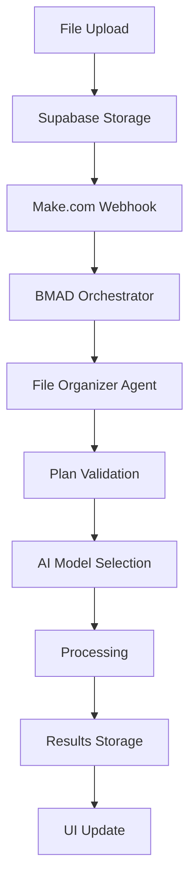

# 🏗️ FileInASnap Architecture Guide

## BMAD Methodology & Agent Container Registry

FileInASnap implements the **Build-Measure-Analyze-Deploy (BMAD)** methodology through a containerized agent architecture. Each AI agent operates independently while sharing common infrastructure and pricing logic.

## 🎯 Core Architecture Principles

### 1. **Modular Agent Design**
Each agent is a self-contained module with:
- **Input validation** and plan verification
- **AI model abstraction** based on subscription tier
- **Error handling** with fallback mechanisms
- **Performance monitoring** and analytics logging

### 2. **Subscription-Aware Gating**
All agents integrate with the centralized pricing system:
```typescript
import { hasFeature, getAIConfig } from '../pricingConfig';

export async function agentFunction(planName: PlanName, input: any) {
  // Feature gate check
  if (!hasFeature(planName, 'requiredFeature')) {
    throw new Error('Feature not available in current plan');
  }
  
  // Get AI model for this plan
  const aiConfig = getAIConfig(planName);
  const result = await callAIModel(aiConfig.primaryModel, input);
  
  return result;
}
```

### 3. **BMAD Orchestration Flow**

#### Build Phase
```typescript
async function buildPhase(plan: PlanName) {
  // Sequential agent execution
  await buildFileIntelligence(plan);
  await buildJournaling(plan);
  await buildRelationship(plan);
  await buildStoryModules(plan);
}
```

#### Measure Phase
```typescript
function measurePhase() {
  // Performance metrics collection
  logAgentInvocation({
    agentName: 'fileOrganizerAgent',
    timestamp: new Date().toISOString(),
    durationMs: executionTime,
    success: true
  });
}
```

#### Analyze Phase
```typescript
function analyzePhase(plan: PlanName) {
  // Analytics aggregation (Enterprise only)
  if (hasFeature(plan, 'fallbackAnalytics')) {
    const summary = getAnalyticsSummary(plan);
    generateInsights(summary);
  }
}
```

#### Deploy Phase
```typescript
function deployPhase() {
  // Results persistence to Supabase
  // Webhook notifications to Make.com
  // UI state updates
}
```

## 🤖 Agent Container Registry

### File Organizer Agent Container
```typescript
interface FileOrganizerContainer {
  name: 'fileOrganizerAgent';
  version: '1.0.0';
  
  // Resource requirements
  resources: {
    cpu: '100m';
    memory: '256Mi';
    gpu: false;
  };
  
  // AI model capabilities
  models: {
    'gpt-3.5-turbo': GPT35Handler;
    'gpt-4': GPT4Handler;
    'gemini-pro': GeminiHandler;
  };
  
  // Feature dependencies
  requires: ['fileIntelligence'];
  
  // Input/Output schemas
  inputSchema: FileUploadSchema;
  outputSchema: FileMetadataSchema;
}
```

### Journal Agent Container
```typescript
interface JournalAgentContainer {
  name: 'journalAgent';
  version: '1.0.0';
  
  resources: {
    cpu: '200m';
    memory: '512Mi';
    gpu: false;
  };
  
  models: {
    'gpt-4': EmotionAnalysisHandler;
    'claude-3-sonnet': NarrativeHandler;
  };
  
  requires: ['journaling', 'documentParsing'];
  
  inputSchema: JournalEntrySchema;
  outputSchema: JournalAnalysisSchema;
}
```

### Relationship Agent Container
```typescript
interface RelationshipAgentContainer {
  name: 'relationshipAgent';
  version: '1.0.0';
  
  resources: {
    cpu: '500m';
    memory: '1Gi';
    gpu: true; // Face recognition requires GPU
  };
  
  models: {
    'claude-3-sonnet': FaceRecognitionHandler;
    'claude-3-opus': RelationshipMappingHandler;
  };
  
  requires: ['relationshipMapping', 'faceRecognition'];
  
  inputSchema: ImageBufferSchema;
  outputSchema: RelationshipResultSchema;
}
```

### Story Agent Container
```typescript
interface StoryAgentContainer {
  name: 'storyAgent';
  version: '1.0.0';
  
  resources: {
    cpu: '300m';
    memory: '768Mi';
    gpu: false;
  };
  
  models: {
    'claude-3-sonnet': StoryGenerationHandler;
    'claude-3-opus': NarrativeWeavingHandler;
  };
  
  requires: ['storyGeneration'];
  
  inputSchema: StoryRequestSchema;
  outputSchema: StorySummarySchema;
}
```

### Analytics Agent Container
```typescript
interface AnalyticsAgentContainer {
  name: 'analyticsAgent';
  version: '1.0.0';
  
  resources: {
    cpu: '150m';
    memory: '384Mi';
    gpu: false;
  };
  
  models: {
    'gpt-4': InsightGenerationHandler;
  };
  
  requires: ['fallbackAnalytics'];
  
  inputSchema: AnalyticsQuerySchema;
  outputSchema: AnalyticsSummarySchema;
}
```

## 🔄 Data Flow Architecture

### 1. **File Upload Pipeline**


### 2. **Agent Communication**
```typescript
interface AgentMessage {
  agentId: string;
  action: 'process' | 'status' | 'error';
  payload: any;
  metadata: {
    planName: PlanName;
    userId: string;
    timestamp: string;
  };
}
```

### 3. **State Management**
```typescript
interface ApplicationState {
  // User context
  currentPlan: PlanName;
  userId: string;
  
  // Agent states
  agents: {
    [agentName: string]: {
      status: 'idle' | 'processing' | 'error';
      lastRun: string;
      metrics: AgentMetrics;
    };
  };
  
  // Feature flags
  features: PlanFeatures;
  
  // Usage tracking
  usage: {
    storageUsed: number;
    uploadsThisMonth: number;
    apiCallsThisMonth: number;
  };
}
```

## 🔧 Configuration Management

### Environment-Based Configuration
```typescript
interface EnvironmentConfig {
  // AI API Keys
  OPENAI_API_KEY: string;
  ANTHROPIC_API_KEY: string;  
  GOOGLE_API_KEY: string;
  
  // Storage & Database
  SUPABASE_URL: string;
  SUPABASE_ANON_KEY: string;
  MONGO_URL: string;
  
  // Orchestration
  MAKE_WEBHOOK_URL: string;
  MAKE_API_KEY: string;
  
  // Performance
  MAX_CONCURRENT_AGENTS: number;
  AGENT_TIMEOUT_MS: number;
  RETRY_ATTEMPTS: number;
}
```

### Dynamic Plan Configuration
```typescript
// Automatically loads active pricing experiment
const currentPricing = getActivePricing();

// Feature availability check
const canUseStories = hasFeature(userPlan, 'storyGeneration');

// AI model selection
const aiConfig = getAIConfig(userPlan);
```

## 📊 Monitoring & Observability

### Agent Health Checks
```typescript
interface AgentHealthCheck {
  agentName: string;
  status: 'healthy' | 'degraded' | 'unhealthy';
  lastHealthCheck: string;
  responseTime: number;
  errorRate: number;
  resourceUsage: {
    cpu: number;
    memory: number;
    gpu?: number;
  };
}
```

### Performance Metrics
```typescript
interface AgentMetrics {
  totalInvocations: number;
  successRate: number;
  averageResponseTime: number;
  errorBreakdown: Record<string, number>;
  resourceUtilization: ResourceUsage;
  costMetrics: {
    apiCallCost: number;
    computeCost: number;
    storageCost: number;
  };
}
```

## 🚀 Deployment Architecture

### Container Orchestration
```yaml
# docker-compose.yml
version: '3.8'
services:
  bmad-orchestrator:
    image: fileinasnap/orchestrator:latest
    environment:
      - NODE_ENV=production
    depends_on:
      - file-agent
      - journal-agent
      - relationship-agent
      - story-agent
  
  file-agent:
    image: fileinasnap/file-agent:latest
    resources:
      limits:
        cpus: '0.5'
        memory: 512M
  
  journal-agent:
    image: fileinasnap/journal-agent:latest  
    resources:
      limits:
        cpus: '0.7'
        memory: 768M
```

### Scaling Strategy
- **Horizontal Scaling**: Multiple agent instances for high throughput
- **Vertical Scaling**: Increase resources based on subscription tier
- **Auto-scaling**: Dynamic scaling based on queue depth and response times

## 🔐 Security Architecture

### Agent Isolation
- Each agent runs in isolated containers
- Network policies restrict inter-agent communication
- Resource limits prevent resource exhaustion

### Data Protection
- End-to-end encryption for file storage
- API key rotation and secure storage
- User data isolation by tenant

### Access Control
- Plan-based feature gating at agent level
- API rate limiting based on subscription tier
- Audit logging for all agent invocations

## 🔮 Future Architecture Evolution

### Planned Enhancements
1. **Multi-region Deployment** - Global agent distribution
2. **Edge Computing** - Local agent processing for privacy
3. **Custom Agent Development** - User-defined agent creation
4. **Real-time Streaming** - Live agent result streaming
5. **AI Model Fine-tuning** - User-specific model customization

This architecture ensures FileInASnap can scale from individual users to enterprise deployments while maintaining modularity, performance, and cost-effectiveness.